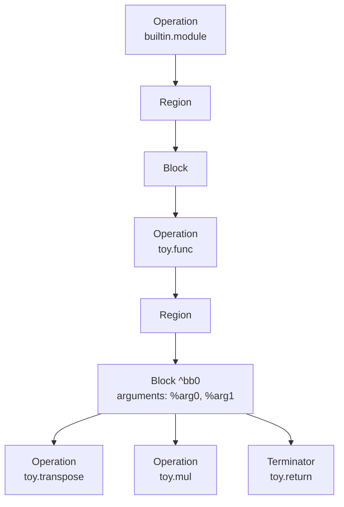

# 00. MLIR basics

This is the prerequisite, and it is about MLIR itself rather than Toy. Anyone who
has written an MLIR dialect can skip straight to
[05-dialect.md](05-dialect.md).

## What this is for

The other documents read IR constantly. They print it, diff it, and argue about
what a pass did to it, and they assume you can look at a line like
`%2 = toy.mul %0, %1 : tensor<*xf64>` and see the operation, its operands, its
result and its type. This document is where that literacy comes from.

The split with the other documents is deliberate. Here you learn to *read* the
IR; [05-dialect.md](05-dialect.md) explains the C++ and TableGen that produce it.
Where a concept appears in both, this document gives you the two sentences you
need to follow the output and points at the one that goes deep.

## MLIR is a framework for IRs, not an IR

LLVM IR has a fixed instruction set and a fixed type system. That is what makes
it a good target and a bad place to reason about a tensor language: by the time a
program is expressed in loads, stores and branches, the fact that one of those
loops was a transpose has been thrown away, and no analysis can get it back.

MLIR inverts that. Almost nothing is built in. You define your own operations,
types and attributes, they live alongside everyone else's in the same module, and
you lower them toward LLVM in steps you choose. `transpose(transpose(x))` folds
to `x` in this compiler because at the moment the fold runs, the operation still
means transpose. [`../ARCHITECTURE.md`](../ARCHITECTURE.md) makes the full
argument for why the rebuild is organized around that idea.

## One structure, for every dialect

MLIR has one IR with one shape, and every dialect uses it:

- An operation may hold regions.
- A region holds blocks.
- A block holds operations.

The recursion bottoms out at operations with no regions, which is most of them.



A value comes from exactly one of two places: it is a result of an operation, or
it is an argument of a block. Values are SSA, assigned once and never reassigned,
so the definition of a value is always a single point in the IR and every use can
be traced back to it. The last operation in a block is its terminator.

The generic form shows all of this at once. `builtin.module` is an operation with
a region; `toy.func` is an operation with a region whose block takes the function
parameters as its arguments; `toy.return` terminates that block:

```console
$ build/bin/toyc docs/examples/ex.toy -emit=mlir --mlir-print-op-generic 2>&1 | sed -n '1,7p'
"builtin.module"() ({
  "toy.func"() <{function_type = (tensor<*xf64>, tensor<*xf64>) -> tensor<*xf64>, sym_name = "multiply_transpose"}> ({
  ^bb0(%arg0: tensor<*xf64>, %arg1: tensor<*xf64>):
    %5 = "toy.transpose"(%arg0) : (tensor<*xf64>) -> tensor<*xf64>
    %6 = "toy.transpose"(%arg1) : (tensor<*xf64>) -> tensor<*xf64>
    %7 = "toy.mul"(%5, %6) : (tensor<*xf64>, tensor<*xf64>) -> tensor<*xf64>
    "toy.return"(%7) : (tensor<*xf64>) -> ()
```

That uniformity is what a pass written before Toy existed depends on: walking the
IR only needs the structure, never the vocabulary. It also means a function body,
a loop body and a whole module are the same kind of thing, so nesting needs no
special cases.

For the full field list of an operation, including successors and properties, see
[05-dialect.md](05-dialect.md).

## Reading the textual format

Every operation can print two ways.

The pretty form is the syntax the dialect defines for itself, and it is what you
normally see:

```console
$ build/bin/toyc docs/examples/ex.toy -emit=mlir 2>&1 | sed -n '2,6p'
  toy.func private @multiply_transpose(%arg0: tensor<*xf64>, %arg1: tensor<*xf64>) -> tensor<*xf64> {
    %0 = toy.transpose(%arg0 : tensor<*xf64>) to tensor<*xf64>
    %1 = toy.transpose(%arg1 : tensor<*xf64>) to tensor<*xf64>
    %2 = toy.mul %0, %1 : tensor<*xf64>
    toy.return %2 : tensor<*xf64>
```

The generic form, above, is the fallback that works for any operation whether or
not its dialect defines a syntax. Reach for it when you want to see the real
structure, and when a pretty form is hiding whether something is an operand or an
attribute.

The same multiply, taken apart in both forms:

| Piece | Pretty | Generic | What it is |
| --- | --- | --- | --- |
| result | `%2` | `%7` | the name of the value this defines, for this printout only |
| op name | `toy.mul` | `"toy.mul"` | dialect namespace, then the mnemonic; quoted in the generic form |
| operands | `%0, %1` | `(%5, %6)` | values it reads, each defined earlier |
| type | `: tensor<*xf64>` | `: (tensor<*xf64>, tensor<*xf64>) -> tensor<*xf64>` | one type when operands and result agree; the generic form is always functional |

Those `%` names are not part of the IR. The printer generates them, which is why
the same operation is `%2` in one form and `%7` in the other. An operation's
identity is its address in memory.

Where an operation has attributes, the generic form prints inherent ones inside
`<{...}>` and discardable ones inside `{...}`. That distinction, and the operand
versus attribute question behind it, is covered in
[05-dialect.md](05-dialect.md).

## Types and attributes

A type describes a value; an attribute is compile-time data attached to an
operation. Both are immutable, both are uniqued in the `MLIRContext`, and both are
handles two words wide that you pass by value. Uniquing is why comparing two types
is a pointer comparison.

Builtin ones need no prefix, which is why `f64`, `index`, `tensor<2x3xf64>` and
`memref<3x2xf64>` appear bare. A dialect's own type is written `!dialect.name`,
and its own attribute `#dialect.name`:

```console
$ build/bin/toyc reference/tests/Ch7/struct-codegen.toy -emit=mlir 2>&1 | sed -n '2,3p'
  toy.func private @multiply_transpose(%arg0: !toy.struct<tensor<*xf64>, tensor<*xf64>>) -> tensor<*xf64> {
    %0 = toy.struct_access %arg0[0] : !toy.struct<tensor<*xf64>, tensor<*xf64>> -> tensor<*xf64>
```

Everything after `!toy.` is the dialect's own grammar, parsed by a hook it
provides. [10-struct-type.md](10-struct-type.md) implements exactly that, and is
the place to look for how uniquing and storage actually work.

`tensor<*xf64>` is worth naming now because it is everywhere in this compiler: an
unranked tensor, meaning the element type is known and the shape is not yet.

## Locations ride along

Every operation carries a location. It is not printed unless you ask:

```console
$ build/bin/toyc docs/examples/ex.toy -emit=mlir --mlir-print-debuginfo 2>&1 | sed -n '3,4p'
    %0 = toy.transpose(%arg0 : tensor<*xf64>) to tensor<*xf64> loc("docs/examples/ex.toy":3:10)
    %1 = toy.transpose(%arg1 : tensor<*xf64>) to tensor<*xf64> loc("docs/examples/ex.toy":3:25)
```

Locations compose, and survive transformation. After inlining, an operation that
came from the body of `multiply_transpose` records both where it was written and
the call it was inlined into:

```console
$ build/bin/toyc docs/examples/ex.toy -emit=mlir -opt --mlir-print-debuginfo 2>&1 | sed -n '4,5p'
    %1 = toy.transpose(%0 : tensor<2x3xf64>) to tensor<3x2xf64> loc(callsite("docs/examples/ex.toy":3:10 at "docs/examples/ex.toy":9:11))
    %2 = toy.mul %1, %1 : tensor<3x2xf64> loc(callsite("docs/examples/ex.toy":3:23 at "docs/examples/ex.toy":9:11))
```

That is why a diagnostic can still point at a line of Toy after several passes
have rewritten the operation, and why the DWARF in an object file needs no
separate bookkeeping in the front end. [12-debug-info-and-objects.md](12-debug-info-and-objects.md)
picks that up.

## Dialects coexist

A dialect is a namespace that owns a set of operations, types and attributes.
Nothing requires a module to use only one, which is what makes lowering in steps
possible. Partway down this pipeline, one function holds affine loops, arith
arithmetic, memref allocations and a surviving `toy.print`:

```console
$ build/bin/toyc docs/examples/ex.toy -emit=mlir-affine -opt 2>&1 | sed -n '17,24p'
    affine.for %arg0 = 0 to 3 {
      affine.for %arg1 = 0 to 2 {
        %0 = affine.load %alloc_5[%arg1, %arg0] : memref<2x3xf64>
        %1 = arith.mulf %0, %0 : f64
        affine.store %1, %alloc[%arg0, %arg1] : memref<3x2xf64>
      }
    }
    toy.print %alloc : memref<3x2xf64>
```

That is four dialects inside one function, at two levels of abstraction at once. A
compiler that had to convert a whole module in one step could not express that
state, and could not run an affine loop optimization before the loops became
branches.

An operation from a dialect nobody registered still parses in generic form, and
then nothing checks it, because the checking lives in the dialect.
[05-dialect.md](05-dialect.md) covers registration and what it buys.

## The vocabulary of transformation

These words appear throughout the other documents. Two sentences each, then the
document that owns them.

| Term | What it is | Explained in |
| --- | --- | --- |
| Trait | A compile-time mixin on an operation that adds invariants and behavior, such as `Pure` or `Terminator`. Generic code tests for a trait to know what it may assume. | [05](05-dialect.md) |
| Interface | A contract an operation or a dialect implements so that generic code can ask it a question, resolved at run time. This is how a pass works on a dialect that postdates it. | [07](07-interfaces.md) |
| Pass | A unit of work over one operation and everything nested inside it, scheduled by a pass manager that can nest pipelines and run them in parallel. | [11](11-driver-and-pipeline.md) |
| Pattern | A local rewrite: match a shape of IR, replace it. A driver applies a set of them until nothing changes. | [06](06-patterns-and-folding.md) |
| Folding | Replacing an operation with an already-available value or a constant, rather than with new operations. | [06](06-patterns-and-folding.md) |
| Canonicalization | The pass that applies each dialect's registered patterns and folders to put IR in a standard form. | [06](06-patterns-and-folding.md) |
| Conversion | A legality-driven rewrite between dialects: declare what may remain, supply patterns, let the framework find a path. | [08](08-lowering-to-affine.md), [09](09-lowering-to-llvm.md) |
| ODS | Operation Definition Specification, the TableGen in which operations are declared so that `mlir-tblgen` can generate their C++. | [05](05-dialect.md) |

## The tools

Three programs come with MLIR, and all three live in the LLVM build rather than
in this repo.

`mlir-opt` takes MLIR in and emits MLIR out, running whatever passes you name. It
verifies the IR between passes, which makes it the natural place to debug a
pipeline. It needs `--allow-unregistered-dialect` before it will accept operations
it does not know.

`mlir-translate` takes MLIR in and emits something else, which is how the LLVM
dialect becomes LLVM IR.

`mlir-tblgen` turns ODS into C++ at build time.

A real compiler ships its own driver. `toyc` is that driver here, and it registers
MLIR's own command-line options as well, which is why
`--mlir-print-op-generic` and `--mlir-print-debuginfo` work above.
[11-driver-and-pipeline.md](11-driver-and-pipeline.md) covers it.

## Glossary

| Term | Meaning |
| --- | --- |
| Operation | The unit of the IR. Has a name, operands, results, attributes, regions, successors and a location |
| Region | An ordered list of blocks owned by an operation |
| Block | An ordered list of operations, ending in a terminator, with its own arguments |
| Block argument | A value defined by a block rather than by an operation, such as a function parameter |
| Value | An SSA value: either an operation result or a block argument |
| Terminator | The operation that ends a block |
| Type | What a value is. Uniqued, immutable, compared by pointer |
| Attribute | Compile-time data on an operation, with no use-def edge |
| Location | Where an operation came from. Present on every operation, composes under transformation |
| Module | The top-level operation, `builtin.module`, holding everything to be compiled |
| Symbol | A named, referable operation such as a function, looked up by name rather than by SSA value |
| Unranked tensor | `tensor<*xf64>`: element type known, shape not yet inferred |
| `MLIRContext` | Owns the uniqued types, attributes and locations, and the loaded dialects |

## Where to go next

[`README.md`](README.md) lists the walkthroughs in the order the upstream tutorial
introduces them. The shortest path from here to understanding this compiler is
[04-mlirgen.md](04-mlirgen.md) for how the IR gets built, then
[05-dialect.md](05-dialect.md) for how the dialect that defines it is written.
