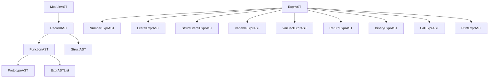

# 02. AST, the visitor, and the dumper

Files: `include/toy/AST.h` (323), `include/toy/ASTVisitor.h` (81), `include/toy/ASTDumper.h` (94), `src/ASTDumper.cpp` (427)

## What these do

`AST.h` declares the parse tree. `ASTVisitor.h` walks it. `ASTDumper` prints it. The split matters because there are two consumers of the tree, the dumper and `MLIRGen`, and only one traversal between them.

The tree itself knows nothing about its consumers. There is no `accept()` method, no `codegen()`, and no `dump()` member. It also knows nothing about MLIR, which `ldd` confirms: `FrontendTests` links `libToyFrontend.a` and no MLIR library at all.

## The node hierarchy

Nine expression kinds and two record kinds:



`ExprASTList` is `std::vector<std::unique_ptr<ExprAST>>`, so a function body is a list of statements, and Toy has no block nesting below that.

## LLVM-style RTTI

Each node carries a `Kind` enum set by its constructor, and a static `classof` (`include/toy/AST.h:57`, `:88`):

```c++
class ExprAST {
public:
  enum ExprASTKind {
    Expr_VarDecl,
    Expr_Return,
    Expr_Num,
    ...
  };
  ExprASTKind getKind() const { return kind; }
```

```c++
class NumberExprAST : public ExprAST {
  ...
  static bool classof(const ExprAST *c) { return c->getKind() == Expr_Num; }
};
```

That is all `llvm::isa<>`, `llvm::dyn_cast<>` and `llvm::cast<>` need. LLVM avoids `dynamic_cast` for two reasons that both apply here: it needs RTTI enabled, which much of LLVM is built without, and it is slower than comparing an integer. A `dyn_cast` compiles to a load, a compare and a branch.

The same mechanism reappears one layer up, on MLIR's own types and operations, so learning it here pays off in [05-dialect.md](05-dialect.md).

Ownership is `std::unique_ptr` throughout, and the tree is destroyed by destroying `ModuleAST`. Accessors hand out raw pointers or `llvm::ArrayRef`, so nothing takes a second owner.

## One switch, two consumers

Upstream writes the nine-case switch twice: once in `parser/AST.cpp` to print, once in `mlir/MLIRGen.cpp` to emit IR. Both are exhaustive, and both have to be edited when a node is added.

Here the switch lives once, in `ASTVisitor` (`include/toy/ASTVisitor.h:49`):

```c++
template <typename Derived, typename RetTy = void> class ASTVisitor {
  Derived &derived() { return *static_cast<Derived *>(this); }

public:
  RetTy visit(ExprAST &expr) {
    switch (expr.getKind()) {
    case ExprAST::Expr_VarDecl:
      return derived().visitVarDecl(llvm::cast<VarDeclExprAST>(expr));
    ...
    }
    // No default: a new ExprASTKind makes -Wswitch fire here rather than
    // silently falling through at run time.
    llvm_unreachable("unknown ExprASTKind");
  }
};
```

This is CRTP: the derived class is a template parameter, so `derived().visitVarDecl(...)` is resolved at compile time and there is no virtual call. The consequence that matters is the return type. `RetTy` is a template parameter, so each consumer picks its own:

```c++
class ASTDumper : public ASTVisitor<ASTDumper>                       // void
class MLIRGenImpl                                                    // FailureOr<Value>
    : public ASTVisitor<MLIRGenImpl, mlir::FailureOr<mlir::Value>>
```

A virtual `accept()` cannot do that. It would have to fix one return type for every visitor, and the dumper would end up returning a value it has no use for, or `MLIRGen` would have to smuggle its result out through a member.

Each consumer declares its hooks private and befriends the base, so the hooks are reachable only through `visit()`.

The omitted `default:` is deliberate. Adding a tenth `ExprASTKind` makes `-Wswitch` fire in exactly one file, and then every visitor fails to compile until it handles the new node.

## The trade this makes

The node set is closed and the set of operations over it is open. Adding a consumer is easy: derive from `ASTVisitor` and write nine hooks, touching nothing that already exists. Adding a node kind is intrusive: every visitor must change.

MLIR makes the opposite trade. A dialect can add operations without touching the passes that transform them, and a pass asks an operation for a capability through an interface rather than switching on its kind. The cost is that MLIR needs the whole interface and trait machinery to do it, where the AST needs one switch. [07-interfaces.md](07-interfaces.md) shows that machinery on Toy's own `ShapeInference` interface, and it is worth reading this section again afterwards: the same program is extensible along opposite axes at its two levels.

## The dumper, two styles

`ASTDumper` is the second consumer and the one with nothing behind it. Its sources include `<llvm/Support/raw_ostream.h>` and the AST headers, and no MLIR header, which is the check that the tree really is IR-independent.

It prints in two formats, selected by `--dump-ast-style`. `Style::Toy` is a port of `reference/Ch7/parser/AST.cpp` and reproduces `toyc-ch7 -emit=ast` byte for byte. Three oddities in it are inherited on purpose, and `src/ASTDumper.cpp:10` lists them: a trailing space in `"Function "`, a number line with no label, and a struct-literal line that runs into its first child.

```console
$ build/bin/toyc docs/examples/ex.toy -emit=ast 2>&1 | head -14
  Module:
    Function 
      Proto 'multiply_transpose' @docs/examples/ex.toy:2:1
      Params: [a, b]
      Block {
        Return
          BinOp: * @docs/examples/ex.toy:3:23
            Call 'transpose' [ @docs/examples/ex.toy:3:10
              var: a @docs/examples/ex.toy:3:20
            ]
            Call 'transpose' [ @docs/examples/ex.toy:3:25
              var: b @docs/examples/ex.toy:3:35
            ]
      } // Block
```

`Style::Kaleidoscope` renders the same nodes with a label, a value, a location, and captioned children one level deeper. It is a second rendering of Toy's own tree rather than a port of anything, so the captions were chosen for this node set; the table at `src/ASTDumper.cpp:24` records each choice.

```console
$ build/bin/toyc docs/examples/ex.toy -emit=ast --dump-ast-style=kaleidoscope 2>&1 | head -14
Function
  Prototype multiply_transpose (a b) @2
  Body:
    Return @3:3
      Value:
        Binary '*' @3:23
          LHS:
            Call transpose @3:10
              Arg:
                Variable a @3:20
          RHS:
            Call transpose @3:25
              Arg:
                Variable b @3:35
```

Numbers are spelled differently between the styles. `raw_ostream` prints a double in exponent form by default, which is what upstream emits and what `Style::Toy` has to keep, so a literal reads `1.000000e+00` there and `1` in the other style.

Indentation goes through an RAII helper (`include/toy/ASTDumper.h:80`), so an early return cannot leave the level wrong:

```c++
  struct Indent {
    explicit Indent(int &level) : level(++level) {}
    ~Indent() { --level; }
    int &level;
  };
```

## Try it

```console
$ build/bin/toyc <file>.toy -emit=ast                                  # upstream format
$ build/bin/toyc <file>.toy -emit=ast --dump-ast-style=kaleidoscope    # reading format
```

To confirm the first is still byte-identical to upstream:

```console
$ diff <(build/bin/toyc reference/tests/Ch7/struct-ast.toy -emit=ast 2>&1) <(~/dev/08_mlir_toy/build/bin/toyc-ch7 reference/tests/Ch7/struct-ast.toy -emit=ast 2>&1)
12c12
<           BinOp: * @reference/tests/Ch7/struct-ast.toy:11:29
---
>           BinOp: * @reference/tests/Ch7/struct-ast.toy:11:31
14c14
<               BinOp: . @reference/tests/Ch7/struct-ast.toy:11:25
---
>               BinOp: . @reference/tests/Ch7/struct-ast.toy:11:26
19c19
<               BinOp: . @reference/tests/Ch7/struct-ast.toy:11:46
---
>               BinOp: . @reference/tests/Ch7/struct-ast.toy:11:47
```

Three lines differ, all of them binop columns, which is deviation D2 and is explained in [03-parser.md](03-parser.md). Every other line of a 20-line dump matches.

## Pitfalls

The dump goes to stderr.

`Style::Toy` is checked byte for byte by `tests/compat`, so a change to its spacing, punctuation or number formatting shows up as a test failure rather than as a cosmetic diff. The three inherited oddities are marked in the source for that reason.

`getValues()` on `LiteralExprAST` returns the flattened element list, while `getDims()` returns the shape recovered from the nesting. A literal holding nested literals therefore has values that are themselves `LiteralExprAST`, which is why the dumper recurses and `MLIRGen` has a `collectData` helper.
